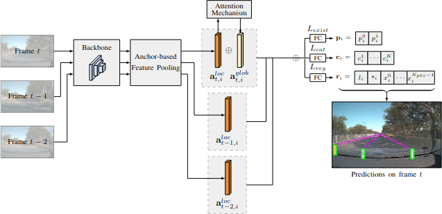

<div align="center">

# Temporal-LaneATT
[](https://ieeexplore.ieee.org/document/9892478)  

</div>

This repository holds the source code for Temporal-LaneATT, a lane detectiom model proposed in the [IJCNN'22 paper](https://ieeexplore.ieee.org/document/9892478) "_Lane Marking Detection and Classification using Spatial-Temporal Feature Pooling_", by [Lucas Tabelini](https://github.com/lucastabelini), [Rodrigo Berriel](http://rodrigoberriel.com), [Alberto F. De Souza](http://www.lcad.inf.ufes.br/team/index.php/Prof._Dr._Alberto_Ferreira_De_Souza), [Claudine Badue](http://www.inf.ufes.br/~claudine/), and [Thiago Oliveira-Santos](http://www.inf.ufes.br/~todsantos/home).


### Installation and usage
The processes for installation and usage are the same ones used for [LaneATT](https://github.com/lucastabelini/LaneATT). Please follow the instructions on the project's page.

### Pre-trained models
Pre-trained models can be found [here](https://drive.google.com/drive/folders/1UEO1Tt44uuuAF4VeD5KjskEwCAoGA9Gd?usp=share_link).

### Citation
If you use this code in your research, please cite:

```bibtex
@InProceedings{tabelini2022ijcnn,
  author    = {Lucas Tabelini
               and Rodrigo Berriel
               and Alberto Ferreira De Souza
               and Claudine Badue
               and Thiago Oliveira-Santos},
  title     = {{Lane Marking Detection and Classification using Spatial-Temporal Feature Pooling}},
  booktitle = {International Joint Conference on Neural Networks (IJCNN)},
  year      = {2022}
}
```
